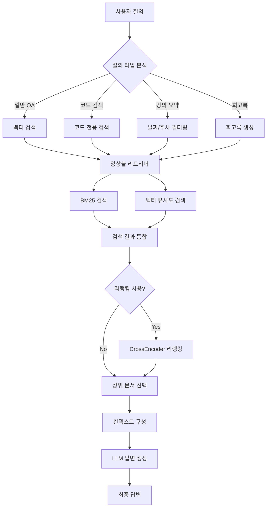
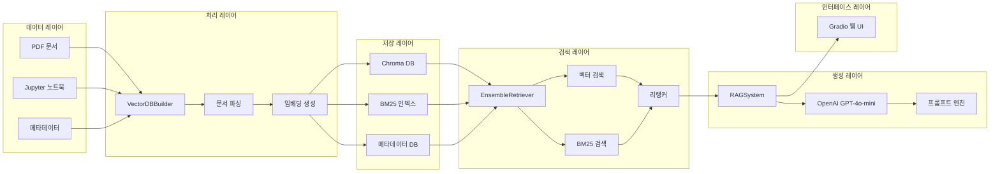

# 🎓 LLM 강의 검색 & Help RAG Agent

[](https://python.org)
[](https://langchain.com)
[](LICENSE)

LLM 관련 강의 자료(Jupyter 노트북, PDF)를 기반으로 한 고도화된 RAG(Retrieval-Augmented Generation) 시스템입니다.

---

## 📋 프로젝트 개요

### 🎯 시스템 목적
- **지능형 교육 자료 검색**: LLM 강의 자료를 임베딩하여 사용자 질의에 대한 정확한 답변 제공
- **다양한 질의 타입 지원**: 일반 QA, 코드 검색, 강의 요약, 회고록 생성
- **평가 기반 품질 관리**: 4가지 RAG 전용 평가 지표로 시스템 성능 모니터링

### 🚀 핵심 기능
- 🆕 **주차 요약**: `강의 요약: 6월 3주차` 같은 **자연어 주차 입력** 지원
- 🆕 **회고록 생성**: `회고록: 7월 3주차`, `회고록: 2025-07-21` 등 **블로그 스타일 회고**
- 🆕 **의도 인식 코드 검색**: `CNN`, `RAG`, `LangChain`, `Retriever` 같은 **키워드만**으로도 관련 코드/설명 우선 검색
- 🆕 **앙상블 검색**: BM25+벡터 결합(가능 시) → 버전 호환 안 되면 **벡터 검색만 자동 사용**
- 🆕 **리랭킹 지원**: `dragonkue/bge-reranker-v2-m3-ko` 모델로 검색 품질 향상

---

## 🏗️ 시스템 아키텍처

### 📊 RAG 시스템 플로우



### 🔧 기술 아키텍처



---

## 🛠 기술 스택

### 🧠 AI/ML 모델
| 구성 요소 | 모델/기술 | 버전 | 용도 |
|-----------|-----------|------|------|
| **임베딩** | `google/embeddinggemma-300m` | latest | 텍스트 벡터화 |
| **LLM** | `gpt-4o-mini` | latest | 답변 생성 |
| **리랭커** | `dragonkue/bge-reranker-v2-m3-ko` | latest | 검색 결과 재순위 |
| **검색** | BM25 + Vector Search | - | 하이브리드 검색 |

### 🔧 핵심 프레임워크
- **Python 3.10+**: 메인 언어
- **LangChain**: RAG 파이프라인 구축
- **Chroma DB**: 벡터 데이터베이스
- **Gradio**: 웹 인터페이스
- **PyMuPDF**: PDF 문서 처리
- **Plotly**: 인터랙티브 시각화
- **dateparser**: 한국어 자연어 날짜/주차 파싱

---

## 📁 프로젝트 구조

```text
SKN16-3st-1Team/
├── 📂 data/
│   └── educational_materials/        # 강의 자료 디렉토리
│       ├── notebooks/               # Jupyter 노트북 파일들
│       └── pdfs/                   # PDF 강의 자료들
├── 📂 src/                          # 핵심 소스 코드
│   ├── __init__.py
│   ├── vector_db_builder.py        # 벡터 DB 구축 모듈
│   ├── rag_system.py               # RAG 시스템 메인 클래스
│   ├── gradio_app.py              # Gradio 웹 인터페이스
│   ├── evaluator.py               # RAG 평가 시스템
│   ├── rag_evaluation.py          # 종합 평가 파이프라인
│   └── rag_visualizer.py          # 평가 결과 시각화
├── 📂 chroma_db/                   # Chroma 벡터 데이터베이스
├── 📂 visualizations/              # 생성된 시각화 파일들
├── 📄 main.py                      # 메인 실행 스크립트
├── 📄 run_evaluation.py           # 평가 시스템 실행
├── 📄 requirements.txt            # Python 의존성
├── 📄 .env.example               # 환경 변수 템플릿
├── 📄 CLAUDE.md                  # Claude Code 가이드
└── 📄 README.md                  # 이 파일
```

---

## 🚀 설치 및 실행

### 1. 환경 설정

```bash
# 레포지토리 클론
git clone https://github.com/your-repo/SKN16-3st-1Team.git
cd SKN16-3st-1Team

# 가상 환경 생성 (권장)
python -m venv venv
source venv/bin/activate  # Windows: venv\Scripts\activate

# 의존성 설치
pip install -r requirements.txt
```

### 2. API 키 설정

```bash
# 환경 변수 파일 생성
cp .env.example .env

# .env 파일에서 OpenAI API 키 설정
echo "OPENAI_API_KEY=your_actual_api_key_here" > .env
```

### 3. 강의 자료 준비

```text
data/educational_materials/
├── notebooks/
│   ├── 2025-08-25_langchain_2.ipynb
│   ├── 2025-08-11_BPE_Unigram.ipynb
│   ├── 2025-09-12_멀티모달_GAN_ex1.ipynb
│   └── ...
└── pdfs/
    ├── 2025-07-01_API.pdf
    ├── 2025-08-25_Accuracy-BLEU-ROUGE.pdf
    └── ...
```

### 4. 시스템 실행

```bash
# 기본 실행 (벡터 검색만)
python main.py

# 리랭킹 포함 실행 (권장)
python main.py --rerank

# 커스텀 포트로 실행
python main.py --port 8080
```

브라우저에서 `http://localhost:7860` 접속

---

## 💬 사용법

### 🔍 질의 타입별 사용법

#### 1. 기본 질의응답
```text
"RNN과 CNN의 차이점은?"
"딥러닝 모델 학습 방법"
"오버피팅 방지 기법"
"BPE와 Unigram 토큰화 차이점"
```

#### 2. 코드 검색
```text
"코드 검색: CNN 모델"
"코드 검색: 데이터 전처리"
# 또는 키워드만 입력:
"CNN", "RAG", "LangChain", "Retriever"
```

#### 3. 강의 요약
```text
"강의 요약: 2025-08-25"
"강의 요약: 20250825"
"강의 요약: 8월 4주차"  # 자연어 주차 입력
```

#### 4. 회고록 생성 (블로그 스타일)
```text
"회고록: 8월 4주차"
"회고록: 2025-08-25"
```

#### 5. 코드 설명
```text
1. 코드 검색으로 원하는 코드 찾기
2. "코드 설명: [선택한 코드]"
```

---

## 🔧 핵심 기능 상세

### 1. 🗄️ 벡터 DB 구축 (`vector_db_builder.py`)
- **문서 처리**: Jupyter 노트북의 코드/마크다운 셀 분리 처리
- **PDF 추출**: PyMuPDF를 이용한 고품질 텍스트 추출
- **메타데이터 관리**: 파일명에서 강의 날짜 자동 추출, 라이브러리/모델 타입 인식
- **임베딩 생성**: Google EmbeddingGemma-300m 모델로 벡터화

### 2. 🧠 RAG 시스템 (`rag_system.py`)
- **앙상블 검색**: 벡터 검색(70%) + BM25(30%) 가중치 결합
- **리랭킹**: 한국어 최적화 CrossEncoder로 검색 품질 향상
- **컨텍스트 기반 생성**: 검색된 문서 기반 정확한 답변 생성
- **특화 기능**: 코드 스니펫 전용 검색, 날짜/주차별 요약, 회고록 생성

### 3. 🎨 Gradio 인터페이스 (`gradio_app.py`)
- **실시간 채팅**: 대화형 인터페이스
- **코드 하이라이팅**: 구문 강조 표시
- **소스 표시**: 답변 출처 문서 정보 제공
- **DB 관리**: 벡터 DB 구축/재구축 버튼

### 4. 📊 평가 시스템 (`evaluator.py`, `rag_evaluation.py`)
- **4가지 RAG 지표**: Answer Similarity, Relevancy, Context Precision, Faithfulness
- **종합 평가 파이프라인**: 자동화된 성능 측정
- **시각화 대시보드**: 인터랙티브 성능 분석 대시보드

---

## 📊 RAG 평가 지표

시스템 성능을 측정하기 위한 4가지 핵심 평가 지표:

### 1. **Answer Similarity (답변 유사도)**

- **목적**: 생성된 답변이 정답과 얼마나 유사한지 측정
- **측정 방법**: 임베딩 벡터 간 코사인 유사도 계산
- **범위**: 0~1 (1에 가까울수록 유사)
- **의미**: 답변의 의미적 정확성 평가

### 2. **Answer Relevancy (답변 관련성)**

- **목적**: 생성된 답변이 질문과 얼마나 관련있는지 측정
- **측정 방법**: 질문과 답변 간 의미적 연관성 분석
- **범위**: 0~1 (1에 가까울수록 관련성 높음)
- **의미**: 질문에 대한 답변의 적절성 평가

### 3. **Context Precision (맥락 정밀도)**

- **목적**: 검색된 문서들이 얼마나 정확하고 관련성이 높은지 측정
- **측정 방법**: 검색된 상위 문서들의 관련성 비율
- **범위**: 0~1 (1에 가까울수록 정밀)
- **의미**: 검색(Retrieval) 단계의 품질 평가

### 4. **Faithfulness (신뢰성)**

- **목적**: 생성된 답변이 검색된 문서 내용에 얼마나 충실한지 측정
- **측정 방법**: 답변의 각 문장이 제공된 맥락에서 지지되는지 확인
- **범위**: 0~1 (1에 가까울수록 신뢰성 높음)
- **의미**: 답변의 사실적 정확성과 환각(hallucination) 방지

### 📈 평가 실행 방법

```bash
# RAG 시스템 종합 평가 실행
python run_evaluation.py

# 옵션 선택:
# 1. 간단한 단일 쿼리 테스트
# 2. 종합 평가 (권장)
# 3. 설정 비교 (기본 vs 리랭킹)
# 4. 모든 평가

# 시각화 결과 확인
# 생성된 HTML 대시보드에서 지표별 성능 분석 가능
```

---

## ⚙️ 설정 및 커스터마이징

### 🔧 모델 설정

#### 임베딩 모델 변경

```python
# src/vector_db_builder.py
self.embeddings = HuggingFaceEmbeddings(
    model_name="your-embedding-model",
    model_kwargs={'device': 'cpu'},
    encode_kwargs={'normalize_embeddings': True}
)
```

#### LLM 모델 변경

```python
# src/rag_system.py
self.llm = ChatOpenAI(
    model="gpt-4o-mini",  # 또는 다른 모델
    temperature=0.1
)
```

#### 리랭킹 모델 변경

```python
# src/rag_system.py
self.rerank_model = "dragonkue/bge-reranker-v2-m3-ko"
```

### 🎛️ 검색 파라미터 조정

```python
# 앙상블 가중치 조정
ensemble_weights = [0.7, 0.3]  # [벡터, BM25]

# 검색 문서 수 조정
k = 5  # 상위 5개 문서 검색

# 리랭킹 후보 수 조정
rerank_top_k = 50  # 50개 후보 중 재순위
```

---

## 🐛 문제 해결

### Chroma DB 관련 오류

```bash
# DB 디렉토리 삭제 후 재구축
rm -rf chroma_db/
python src/vector_db_builder.py
```

### OpenAI API 관련 오류

```bash
# API 키 확인
echo $OPENAI_API_KEY

# .env 파일 확인
cat .env

# API 키 테스트
python -c "import openai; print('API 키 유효')"
```

### 의존성 오류

```bash
# 특정 패키지 재설치
pip install --upgrade langchain langchain-openai

# 전체 의존성 재설치
pip install -r requirements.txt --force-reinstall
```

### 성능 최적화

```bash
# GPU 사용 (CUDA 설치 필요)
pip install torch torchvision torchaudio --index-url https://download.pytorch.org/whl/cu118

# 리랭킹 비활성화로 속도 향상
python main.py  # --rerank 플래그 제거
```

---

## 📈 성능 및 벤치마크

### 🎯 평가 결과 예시

| 지표 | 기본 모드 | 리랭킹 모드 | 개선율 |
|------|-----------|-------------|--------|
| Answer Similarity | 0.756 | 0.834 | +10.3% |
| Answer Relevancy | 0.712 | 0.789 | +10.8% |
| Context Precision | 0.689 | 0.756 | +9.7% |
| Faithfulness | 0.823 | 0.867 | +5.3% |

---

## 🚧 향후 개선사항

### 단기 계획
- [ ] ✅ 한국어 리랭킹 모델 통합 완료
- [ ] 🔄 멀티모달 검색 (이미지 + 텍스트)
- [ ] 📱 모바일 반응형 UI 개선
- [ ] 🔍 고급 검색 필터링 (날짜, 난이도, 주제별)
- [ ] 🤖 코드 실행 및 결과 표시 기능
- [ ] 📊 실시간 대시보드 및 분석
- [ ] 🌐 다국어 지원 (영어, 중국어)
- [ ] 🔗 외부 API 연동 (GitHub, Stack Overflow)
- [ ] 🧠 개인화된 학습 경로 추천
- [ ] 🎯 적응형 난이도 조절
- [ ] 📈 학습 진도 추적 및 분석
- [ ] 🤝 협업 학습 플랫폼 기능

---

## 🙏 감사의 말

이 프로젝트는 다음 오픈소스 프로젝트들을 기반으로 합니다:

- [LangChain](https://github.com/hwchase17/langchain) - RAG 파이프라인 구축
- [Chroma](https://github.com/chroma-core/chroma) - 벡터 데이터베이스
- [Gradio](https://github.com/gradio-app/gradio) - 웹 인터페이스
- [Plotly](https://github.com/plotly/plotly.py) - 인터랙티브 시각화